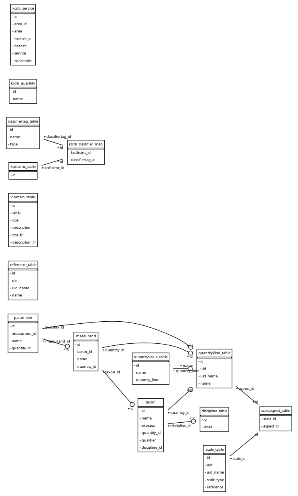

# measurand-flask-app

## Getting started

### Updated Getting started guide
* Create a working directory
* Ensure python3.12 is installed
* Create the virtual environemnt (venv or conda environment)
* For virtual conda environments, use [miniforge](https://github.com/conda-forge/miniforge)

* Setup your environment
```
python3.12 -m venv venv/ --upgrade-deps
source venv/bin/activate
python -m pip install --upgrade pip
pip install -r requirements.txt
```

Also works with conda
```
conda env create --file environment_history.yml
conda activate mdb-test
```

* Initialize the working directory. This will get the latest versions of the taxonomy and m-layer, and initialize the database in specified PATH and link to data in project directory.
* Optionally, PATH can be removed and database reinitialized with TRUE for second or argument.
```
sh init.sh <PATH>
```
or remove the database and reinitialize
```
sh init.sh <PATH> TRUE
```
* Run locally or build container
```
gunicorn -w 1 wsgi
```
or
```
docker compose build
docker compose up
```
* Got to the localhost on browser http://127.0.0.1/8000

### Upgrading python
The application has been upgraded to python 3.12. 

The following steps are used to update the requirements. 

* First setup the conda environment. To do so, change the python version specified in `environment_history.yml`. This contains only the required
packages that are used in the application. The dependencies are determined using conda and conda-forge.
* Next freeze the packages for pip requirements.
`pip list --format=freeze > requirements.txt`
* Next update the Dockerfile to the python base container version, e.g. python:3.12-slim

## Previous Getting started guide

Flask application for MII metadata

In order to setup the test database, several resources are used to initialize the database.
* NCSLI MII Measurand Taxonomy
* M-Layer REST API
```
curl -X 'GET' 'https://dr49upesmsuw0.cloudfront.net/aspects' -H 'accept: application/json' -- output aspects.json 
curl -X 'GET' 'https://dr49upesmsuw0.cloudfront.net/scales' -H 'accept: application/json' -- output scales.json 
```
Updated resource files can be copied to
```
resources
```


```
conda create -n <environment_name> --file requirements.txt
```
* Run the unit test for loading data locally and creating the database
* Set the flask environment to test
```
export FLASK_ENV=testing
python -m unittest
```
* Update to the latest input data for the taxonomy and mlayer.
* Run the mappers.
* Load the data in memory
```
python dbinit.py -p builder.json -m
```
* Create a persistent database. See the builder.json for database path. The current location is in /tmp
```
/tmp/miiflask/miiflask.db
```
* First set the flask environment to development, then create the database using the script.
```
export FLASK_ENV=development
python dbinit.py -p builder.json -d
```
* Update database path in flask [config](./miiflask/flask/config.py) if changed in builder.json.
* To extract data from the KCDB and m-layer APIs, update the builder.json file.
```
use_api=true
```

### Running the flask application
Three modes have configurations for running the flask application. Before running the application export the Flask environment.

#### Testing and Development
* Testing configuration runs an in-memory database that requires extracting and loading the data each time. 

```
export FLASK_ENV=testing
```

* The debug mode uses the database that was initialized from the dbinit.py script. Changes to the database will be persisted, so the user keep changes to the database.

```
export FLASK_ENV=development
```

``` 
cd miiflask/flask
flask run
```
* Go to the localhost on browser http://127.0.0.1/5000
* The administration view can be found at http://127.0.0.1/5000/admin
* For in-memory, you'll need to load some data. Go to http://127.0.0.1/5000/initialize

#### Production
This mode is in progress for running a production service with nginx and gunicorn. As above, initialize the database with dbinit.py.The default port for gunicorn is 8000.
```
export FLASK_ENV=production
gunicorn -w 1 'miiflask.flask.app:app'
```
* Got to the localhost on browser http://127.0.0.1/8000

Below was a diagram of the database schema implemented as a flask [model](./miiflask/flask/model.py).

#### Workshop Demonstration
This mode runs a production server and initializes the database with references of measurand taxons from KCDB CMC identifiers.

```
export FLASK_ENV=demo
dbinit.py -p builder_workshop_2024.json -d 
gunicorn -w 1 'miiflask.flask.app:app'
```
* Go to localhost on browser http://127.0.0.1/8000
* The database is configured to reside in `/tmp/miiflask/miiflask_workshop_2024_demo.db`



## Copyright and License

Copyright © 2023 by NCSL International. All rights reserved

Copyright © 2023 [Ryan Mackenzie White](mailto:ryan.white@nrc-cnrc.gc.ca)

Distributed under terms of the Copyright © 2023 National Research Council Canada. 

Shield: [![CC BY-SA 4.0][cc-by-sa-shield]][cc-by-sa]

This work is licensed under a
[Creative Commons Attribution-ShareAlike 4.0 International License][cc-by-sa].

[![CC BY-SA 4.0][cc-by-sa-image]][cc-by-sa]

[cc-by-sa]: http://creativecommons.org/licenses/by-sa/4.0/
[cc-by-sa-image]: https://licensebuttons.net/l/by-sa/4.0/88x31.png
[cc-by-sa-shield]: https://img.shields.io/badge/License-CC%20BY--SA%204.0-lightgrey.svg
