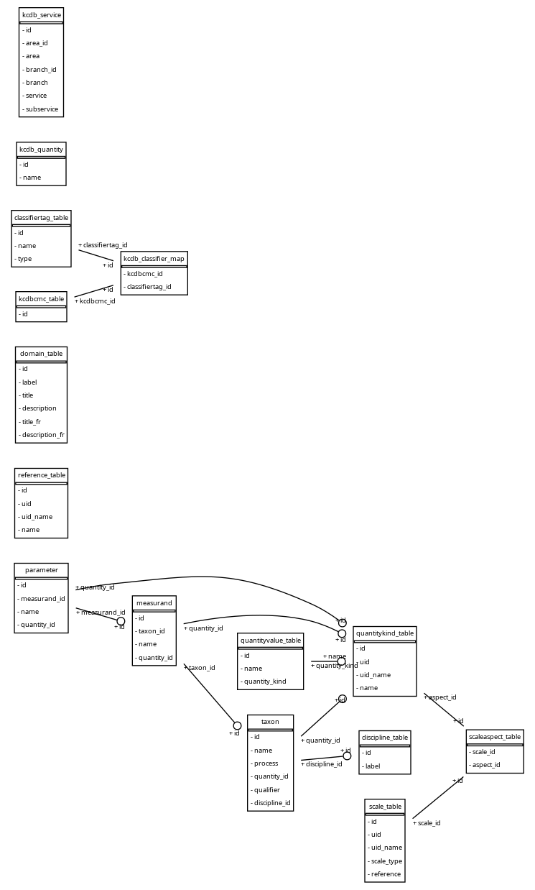

# measurand-flask-app

Flask application for browsing and managing MII measurand, quantity, unit, scale, and taxonomy metadata.

The application database is a SQLite database named:

```text
miiflask.db
```

The application expects this database to be located under the directory specified by the environment variable:

```text
APP_DATA_DIR
```
For example, if:

```bash
export APP_DATA_DIR=/tmp/miiflask
```
then the application will expect the database at:
`/tmp/miiflask/miiflask.db`

The database can be initialized from local or downloaded M-Layer and measurand-taxonomy data sources. The preferred deployment path uses M-Layer JSON data so the deployed database stays aligned with the official API-style data source.

## Getting started locally

To run the application locally:
- Clone this repository.
- Create a Python 3.12 environment.
- Install dependencies.
- Set `APP_DATA_DIR`.
- Initialize the SQLite database.
- Run the Flask application using gunicorn or flask run.

A typical local setup uses a writable data directory such as:

`/tmp/miiflask`

or a project-local directory such as:


`./instance-data`

### Python environment setup
Option 1: Python virtual environment
Ensure Python 3.12 is installed.

```bash
python3.12 -m venv venv --upgrade-deps
source venv/bin/activate
python -m pip install --upgrade pip
pip install -r requirements.txt
```

### Setting APP_DATA_DIR

The Flask application uses APP_DATA_DIR to locate the SQLite database.
Set it before initializing or running the application:

```bash
export APP_DATA_DIR=/tmp/miiflask
mkdir -p "$APP_DATA_DIR"
```

The expected database file is:
`$APP_DATA_DIR/miiflask.db`

For example:

`ls -la "$APP_DATA_DIR"`

should eventually show: `miiflask.db`

after database initialization.
If you use a project-local data directory:

```bash
export APP_DATA_DIR="$PWD/instance-data"
mkdir -p "$APP_DATA_DIR"
```

### Initializing the database with init.sh
The init.sh script downloads the configured versions of the MII measurand taxonomy and M-Layer data, places them under resources/repo, and initializes the SQLite database.
Basic usage:

```bash
sh init.sh <PATH>
```

Example:

```bash
sh init.sh /tmp/miiflask
```

This initializes:
`/tmp/miiflask/miiflask.db`

To remove the existing data directory and reinitialize the database:


```bash
sh init.sh <PATH> true
```
Example:

```bash
sh init.sh /tmp/miiflask true
```

Depending on the shell and platform, the second argument is expected to be the string true.
The script should set:

```bash
export APP_DATA_DIR="$DATA_DIR"
```

so child processes invoked by the script, such as database initialization scripts, see the correct application data directory.

A typical initialization command inside init.sh for the JSON-based deployment path is:

```bash
python dbinit_sqldump.py json \
    --json-dir "resources/repo/m-layer/source/json" \
    --sqlite "$DATA_DIR/miiflask.db" \
    --drop-create \
    --taxonomy-xml "resources/repo/measurand-taxonomy/MeasurandTaxonomyCatalog.xml"
```

If taxonomy roundtrip validation is available but too strict for deployment initialization, the script may use:
`--skip-taxonomy-roundtrip`

For example:

```bash
python dbinit_sqldump.py json \
    --json-dir "resources/repo/m-layer/source/json" \
    --sqlite "$DATA_DIR/miiflask.db" \
    --drop-create \
    --taxonomy-xml "resources/repo/measurand-taxonomy/MeasurandTaxonomyCatalog.xml" \
    --skip-taxonomy-roundtrip
```

### Running the Flask application locally
After the database has been initialized, ensure APP_DATA_DIR points to the directory containing miiflask.db.
Example:

```bash
export APP_DATA_DIR=/tmp/miiflask
```

Then run the application.
Using Gunicorn

```bash
gunicorn -w 1 wsgi
```
or, depending on the application entry point:

```bash
gunicorn -w 1 'miiflask.flask.app:app'
```

Then open: `http://127.0.0.1:8000`
The administration view may be available at: `http://127.0.0.1:8000/admin`

### Working with local data sources

For testing and development, you may want to initialize the database from local copies of the M-Layer and measurand taxonomy data instead of using the versions downloaded by init.sh.
A recommended local structure is:

```text
data/
├── m-layer/
│   └── source/
│       └── json/
│           ├── prefixes.json
│           ├── systems.json
│           ├── dimensions.json
│           ├── aspects.json
│           ├── units.json
│           ├── scales.json
│           ├── functions.json
│           ├── conversions.json
│           └── casts.json
├── measurand-taxonomy/
│   └── MeasurandTaxonomyCatalog.xml
└── sql/
    └── m_layer.dmp
```

The JSON import expects a directory containing the M-Layer JSON collection files. The current JSON importer uses collection files such as:

```text
prefixes.json
systems.json
dimensions.json
aspects.json
units.json
scales.json
functions.json
conversions.json
casts.json
```

The SQL dump importer expects a PostgreSQL plain-text dump that can be transformed into the SQLite application schema.

**Running import_mlayer.py locally**

import_mlayer.py is a utility for importing and validating M-Layer data. It supports:
importing from SQL dump;
importing from JSON;
importing both SQL and JSON into separate SQLite databases;
comparing SQL-derived and JSON-derived SQLite databases.

This script is useful for testing whether the JSON-based importer and SQL-dump importer produce equivalent M-Layer application data.
Import from JSON

```bash
python import_mlayer.py json \
    --json-dir ./data/m-layer/source/json \
    --sqlite ./data/mlayer_json.sqlite \
    --drop-create \
    --batch-size 1000
With strict validation:
```

```bash
python import_mlayer.py json \
    --json-dir ./data/m-layer/source/json \
    --sqlite ./data/mlayer_json.sqlite \
    --drop-create \
    --strict \
    --batch-size 1000
```

Import from SQL dump

```bash
python import_mlayer.py sql-dump \
    --dump ./data/sql/m_layer.dmp \
    --sqlite ./data/mlayer_sql.sqlite \
    --drop-create \
    --batch-size 1000
```

With strict validation:

```bash
python import_mlayer.py sql-dump \
    --dump ./data/sql/m_layer.dmp \
    --sqlite ./data/mlayer_sql.sqlite \
    --drop-create \
    --strict \
    --batch-size 1000
```

Import both JSON and SQL, then compare

```bash
python import_mlayer.py both \
    --dump ./data/sql/m_layer.dmp \
    --json-dir ./data/m-layer/source/json \
    --sql-sqlite ./data/mlayer_sql.sqlite \
    --json-sqlite ./data/mlayer_json.sqlite \
    --drop-create \
    --batch-size 1000 \
    --compare
```

To make mismatches fail the command:

```bash
python import_mlayer.py both \
    --dump ./data/sql/m_layer.dmp \
    --json-dir ./data/m-layer/source/json \
    --sql-sqlite ./data/mlayer_sql.sqlite \
    --json-sqlite ./data/mlayer_json.sqlite \
    --drop-create \
    --batch-size 1000 \
    --compare \
    --fail-on-mismatch
```

Compare two existing SQLite databases

```bash
python import_mlayer.py compare \
    --sql-sqlite ./data/mlayer_sql.sqlite \
    --json-sqlite ./data/mlayer_json.sqlite
```

With failure on mismatch:

```bash
python import_mlayer.py compare \
    --sql-sqlite ./data/mlayer_sql.sqlite \
    --json-sqlite ./data/mlayer_json.sqlite \
    --fail-on-mismatch
```

**Running dbinit_sqldump.py locally**

dbinit_sqldump.py initializes the application database. Unlike import_mlayer.py, this script is intended to create the database used by the Flask application.

It can initialize from either:
M-Layer JSON data; or
an M-Layer SQL dump.

It should also load the measurand taxonomy into the same SQLite database.
Initialize application database from local JSON data
Set the application data directory:

```bash
export APP_DATA_DIR="$PWD/instance-data"
mkdir -p "$APP_DATA_DIR"
```
Run database initialization:

```bash
python dbinit_sqldump.py json \
    --json-dir ./data/m-layer/source/json \
    --sqlite "$APP_DATA_DIR/miiflask.db" \
    --drop-create \
    --taxonomy-xml ./data/measurand-taxonomy/MeasurandTaxonomyCatalog.xml
```

If taxonomy roundtrip validation is enabled but not needed for local smoke testing:

```bash
python dbinit_sqldump.py json \
    --json-dir ./data/m-layer/source/json \
    --sqlite "$APP_DATA_DIR/miiflask.db" \
    --drop-create \
    --taxonomy-xml ./data/measurand-taxonomy/MeasurandTaxonomyCatalog.xml \
    --skip-taxonomy-roundtrip
```

Then run the application:

```
export APP_DATA_DIR="$PWD/instance-data"
gunicorn -w 1 wsgi
```

Open: `http://127.0.0.1:8000`

Initialize application database from local SQL dump

```bash
export APP_DATA_DIR="$PWD/instance-data"
mkdir -p "$APP_DATA_DIR"
```
Then run:

```bash
python dbinit_sqldump.py sql-dump \
    --dump ./data/sql/m_layer.dmp \
    --sqlite "$APP_DATA_DIR/miiflask.db" \
    --drop-create \
    --taxonomy-xml ./data/measurand-taxonomy/MeasurandTaxonomyCatalog.xml
```
Optionally skip taxonomy roundtrip validation:

```bash
python dbinit_sqldump.py sql-dump \
    --dump ./data/sql/m_layer.dmp \
    --sqlite "$APP_DATA_DIR/miiflask.db" \
    --drop-create \
    --taxonomy-xml ./data/measurand-taxonomy/MeasurandTaxonomyCatalog.xml \
    --skip-taxonomy-roundtrip
```
Then run:

```bash
export APP_DATA_DIR="$PWD/instance-data"
gunicorn -w 1 wsgi
```
Switching between JSON and SQL dump sources for testing
The application deployment should use the JSON data source. This keeps the deployed database aligned with the official API-style M-Layer data.
Use JSON for normal initialization:

```bash
python dbinit_sqldump.py json \
    --json-dir ./data/m-layer/source/json \
    --sqlite "$APP_DATA_DIR/miiflask.db" \
    --drop-create \
    --taxonomy-xml ./data/measurand-taxonomy/MeasurandTaxonomyCatalog.xml
```
Use SQL dump only for testing, validation, or comparison:

```
python dbinit_sqldump.py sql-dump \
    --dump ./data/sql/m_layer.dmp \
    --sqlite "$APP_DATA_DIR/miiflask.db" \
    --drop-create \
    --taxonomy-xml ./data/measurand-taxonomy/MeasurandTaxonomyCatalog.xml
```
For importer comparison, use import_mlayer.py both:

```
python import_mlayer.py both \
    --dump ./data/sql/m_layer.dmp \
    --json-dir ./data/m-layer/source/json \
    --sql-sqlite ./data/mlayer_sql.sqlite \
    --json-sqlite ./data/mlayer_json.sqlite \
    --drop-create \
    --compare
```    

**Recommended workflow:**
- Import SQL dump to a temporary SQLite database.
- Import JSON data to a separate temporary SQLite database.
- Compare both databases with import_mlayer.py.
- If the JSON importer is correct, initialize the application database using the JSON path.
- Use the JSON path for deployment.
- Updating data sources for deployment
- The deployment data source versions are configured in init.sh.

The relevant variables are:


```ini
NAME1=measurand-taxonomy
VERSION1=0.3.0-beta

NAME2=m-layer
VERSION2=0.5.0-beta.1
```

Copy

These are used to build GitHub archive URLs:

```ini
URL1="https://github.com/NCSLI-MII/$NAME1/archive/refs/tags/v$VERSION1.tar.gz"
URL2="https://github.com/NCSLI-MII/$NAME2/archive/refs/tags/v$VERSION2.tar.gz"
```

Copy

To update the deployment data source versions:

1. Confirm the new measurand taxonomy release tag exists.
2. Confirm the new M-Layer release tag exists.
3. Update `VERSION1` and/or `VERSION2` in `init.sh`.
4. Run initialization locally using a clean data directory.
5. Confirm the database initializes successfully.
6. Run the Flask application locally against the newly initialized database.
7. Perform application smoke tests.
8. Commit the updated `init.sh`.
9. Create an application release following the release process below.

Example change:

```sh
NAME1=measurand-taxonomy
VERSION1=0.4.0-beta

NAME2=m-layer
VERSION2=0.6.0-beta
```

The deployment path should continue to use M-Layer JSON data:

```sh
python dbinit_sqldump.py json \
    --json-dir "resources/repo/m-layer/source/json" \
    --sqlite "$DATA_DIR/miiflask.db" \
    --drop-create \
    --taxonomy-xml "resources/repo/measurand-taxonomy/MeasurandTaxonomyCatalog.xml"
```

Do not switch deployment to SQL dump unless there is a specific testing or migration reason to do so. JSON is the preferred deployment input because it follows the official API-style data source.
Recommended local verification before deployment
After updating data source versions in init.sh, run a full clean initialization locally:

```bash
rm -rf ./instance-data
sh init.sh ./instance-data true
```
Set the application data directory:

```bash
export APP_DATA_DIR="$PWD/instance-data"
```

Confirm the database exists:

```bash
ls -la "$APP_DATA_DIR/miiflask.db"
```
Run the application:

```bash
gunicorn -w 1 wsgi
```
Open

`http://127.0.0.1:8000`

Recommended checks:

- the application starts without database errors;
- taxonomy pages load;
- quantity, unit, scale, and aspect views load;
- expected measurand taxons are present;
- expected M-Layer aspects and scales are present;
- administration views load if enabled.

## Running with Docker
Data persistence uses Docker volumes. Either define a named volume manually or use Docker Compose.
Example using a named volume:

```bash
docker pull ghcr.io/ncsli-mii/measurand-flask-app:main
docker volume create sqlite_data
docker run -it -p 8000:8000 -v sqlite_data:/data ghcr.io/ncsli-mii/measurand-flask-app:main
```
Then open:

http://127.0.0.1:8000

Using Docker Compose:

docker compose build
docker compose up
The container should set or rely on an application data directory such as:


`/data`
The initialized database should be located at:

`/data/miiflask.db`

## Creating a release
Use the following process to create a new application release.

1. Ensure all development branches are merged into main.
2. Create a release branch from main.

Example:

```bash
git checkout main
git pull
git checkout -b release/0.4.0-beta
```

3. Update the application version in:

`miiflask/flask/config.py`

4. Check `main` contains the updated data sources specified in `init.sh.`

The release also updates deployed data sources, the updated the data versions should already have been merged from a development branch.

`init.sh`

For example:

```ini
   NAME1=measurand-taxonomy
   VERSION1=0.4.0-beta

   NAME2=m-layer
   VERSION2=0.6.0-beta
```
Copy

5. Run a clean local initialization.

```sh
rm -rf ./instance-data
sh init.sh ./instance-data true
```

6. Run the application locally.

```bash
export APP_DATA_DIR="$PWD/instance-data"
gunicorn -w 1 wsgi
```

7. Perform smoke testing.

8. Commit the release changes.

```sh
git add miiflask/flask/config.py init.sh README.md
git commit -m "Prepare release 0.4.0-beta"
```

9. Merge the release branch into main.

```sh
git checkout main
git merge release/0.4.0-beta
```

10. Tag the release.

Example:

git tag v0.4.0-beta
Push main and the release tag.

Copy sh
git push origin main
git push origin v0.4.0-beta

On push, the release branch and tag should trigger the Docker build and publish workflow.

11. Deploy to Azure and locally.

## Troubleshooting
Database file is missing
Confirm APP_DATA_DIR is set:

`echo "$APP_DATA_DIR"`

Confirm the database exists:


`ls -la "$APP_DATA_DIR/miiflask.db"`
If it does not exist, rerun initialization:


`sh init.sh "$APP_DATA_DIR" true`

or initialize manually:

```bash
python dbinit_sqldump.py json \
    --json-dir ./data/m-layer/source/json \
    --sqlite "$APP_DATA_DIR/miiflask.db" \
    --drop-create \
    --taxonomy-xml ./data/measurand-taxonomy/MeasurandTaxonomyCatalog.xml
```

Application is using the wrong database
The database path is determined by APP_DATA_DIR and the fixed database file name miiflask.db.
Check:

```
echo "$APP_DATA_DIR"
ls -la "$APP_DATA_DIR"
```

Restart the Flask application after changing APP_DATA_DIR.
JSON import fails because files are missing
Confirm the JSON directory contains the expected collection files:

`ls -la ./data/m-layer/source/json`
Expected files include:

```text
prefixes.json
systems.json
dimensions.json
aspects.json
units.json
scales.json
functions.json
conversions.json
casts.json
```

SQL dump testing produces different results from JSON
Use import_mlayer.py both with --compare:

```
python import_mlayer.py both \
    --dump ./data/sql/m_layer.dmp \
    --json-dir ./data/m-layer/source/json \
    --sql-sqlite ./data/mlayer_sql.sqlite \
    --json-sqlite ./data/mlayer_json.sqlite \
    --drop-create \
    --compare
```
Review the logged table counts, key mismatches, and field mismatches.
Reinitialize from scratch

```
rm -rf "$APP_DATA_DIR"
mkdir -p "$APP_DATA_DIR"
sh init.sh "$APP_DATA_DIR" true
```

A few notes based on the current code state:

- The current `init.sh` already downloads `measurand-taxonomy` and `m-layer`, then runs `dbinit_sqldump.py json` against `resources/repo/m-layer/source/json`.
- The current `dbinit_sqldump.py` has the JSON and SQL-dump import paths, but its taxonomy import function needs to be wired correctly to the SQLite path and to `TaxonomyMapper`.
- `import_mlayer.py` is better suited for local importer validation and SQL-vs-JSON comparison, while `dbinit_sqldump.py` is the right script to initialize the actual Flask application database.
- Deployment should use JSON data. SQL dump import should remain useful for testing, validation, or migration comparison.




## Copyright and License

Copyright © 2023 by NCSL International. All rights reserved

Copyright © 2023 [Ryan Mackenzie White](mailto:ryan.white@nrc-cnrc.gc.ca)

Distributed under terms of the Copyright © 2023 National Research Council Canada. 

Shield: [![CC BY-SA 4.0][cc-by-sa-shield]][cc-by-sa]

This work is licensed under a
[Creative Commons Attribution-ShareAlike 4.0 International License][cc-by-sa].

[![CC BY-SA 4.0][cc-by-sa-image]][cc-by-sa]

[cc-by-sa]: http://creativecommons.org/licenses/by-sa/4.0/
[cc-by-sa-image]: https://licensebuttons.net/l/by-sa/4.0/88x31.png
[cc-by-sa-shield]: https://img.shields.io/badge/License-CC%20BY--SA%204.0-lightgrey.svg
